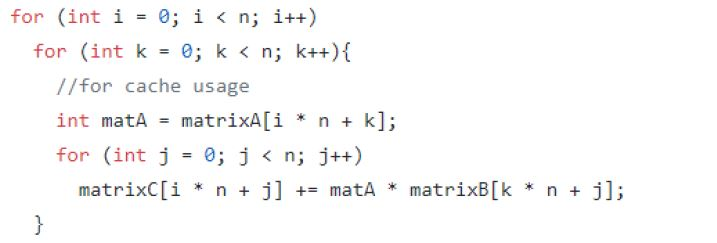
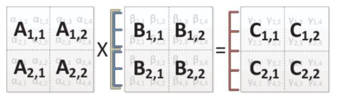
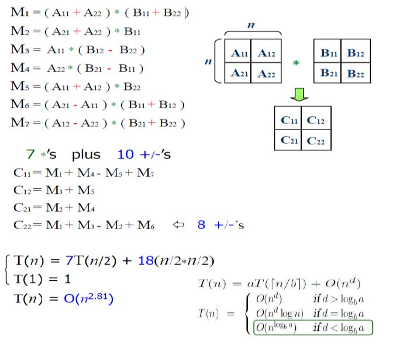
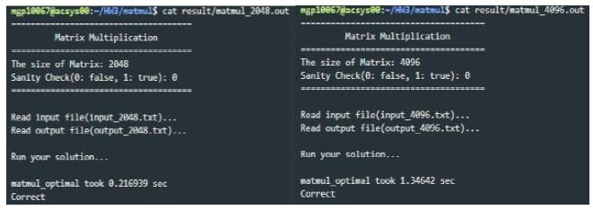

# HW3: Optimizing Matrix Multiplication


## 1 Related Things

### 1-1 ikj method

The technique that uses ikj index in matrix multiplication cannot reduce time complexity. However, the change of steps of calculation can reduce cache miss that actually decreases runtime.



### 1-2 Block Matrix Multiplication

The block matrix multiplication also decreases cache miss by reducing the size of matrix that is multiplied at each time. It applies divide and conquer algorithm to optimize calculation into cache size.



### 1-3 Strassen Algorithm

Strassen Algorithm is also one of divide and conquer algorithm. Unlike other techniques, Strassen algorithm reduces time complexity from O(n3) to O(n2.807). Although the difference of number can be considered as tiny number, the performance extremely improves when the dataset is large.



In the first step, 7 multiplication and 10 addition/subtractions are used to calculate M values. These M values will be used to calculate final values with only 8 additions/subtractions.

## 2 Framework

```bash
/HW3/matmul$ tree .
.
├── build                       // make file generate objective files to here
│   └── driver.o                // only objective file provided!
├── data                        // Saving data here recommended
├── Makefile                    // Compile, Clean, Format, Submit
├── matmul4096.cmd        		// Command for condor
├── matmul2048.cmd        		// Command for condor
├── result                      // Result from condor
└── src                         // Source Code
    ├── generate.cpp
    ├── matmul.cpp
    └── matmul.h

4 directories, 7 files
```

## 3 Result

```bash
/HW3/matmul$ ./matmul data/input.txt data/output.txt 1
=====================================
         Matrix Multiplication       
=====================================
The size of Matrix: 4
Sanity Check(0: false, 1: true): 1
=====================================

Read input file(data/input.txt)...
Read output file(data/output.txt)...

Run sanity check for input, output...

matmul_ref took 2.273e-06 sec
Problem(data/input.txt) and 
Solution(data/output.txt) are
Matched!

Run your solution...

matmul_optimal took 0.00172086 sec
Correct

```

### 3-1 Actual Result that apply ikj, Strassen and OMP




## 4 Reference

[HW3 Specification](https://docs.google.com/document/d/1j_0XSWhXnfmM-YwNsCuYPx5cXOpv121iUiIhLXRJa6c/edit?usp=sharing)
